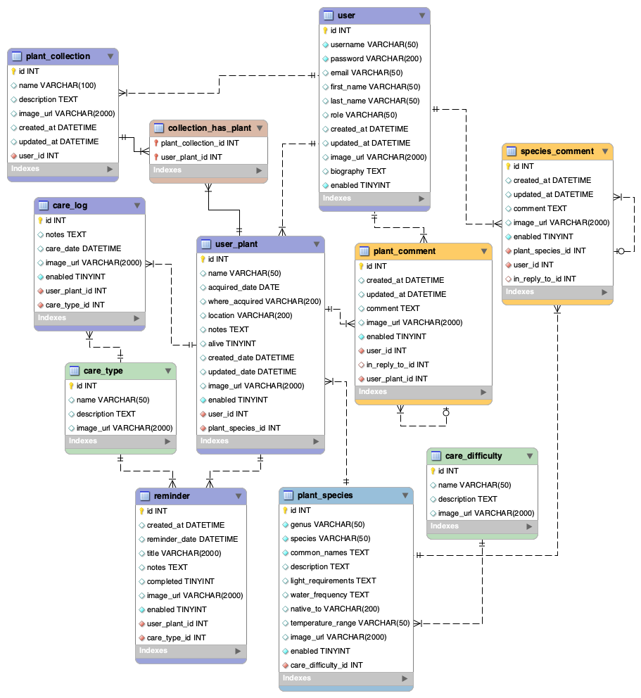

## Description

## technologies used
 - Java
 - Eclipse
 - Git/GitHub
 - Sublime Text Editor
 - zsh
 - Springboot
 - Postman
 - SQL Workbench
 - JPA/Hibernate
 - Gradle
 - JavaScript
 - Bootstrap
 - html/CSS
 - Angular

 ## SQL Diagram

 ## Entities & Relationships

    User: 
    plant

 ## REST API Endpoints

 ## Lessons Learned

 ## Notes

 ## How to Run

